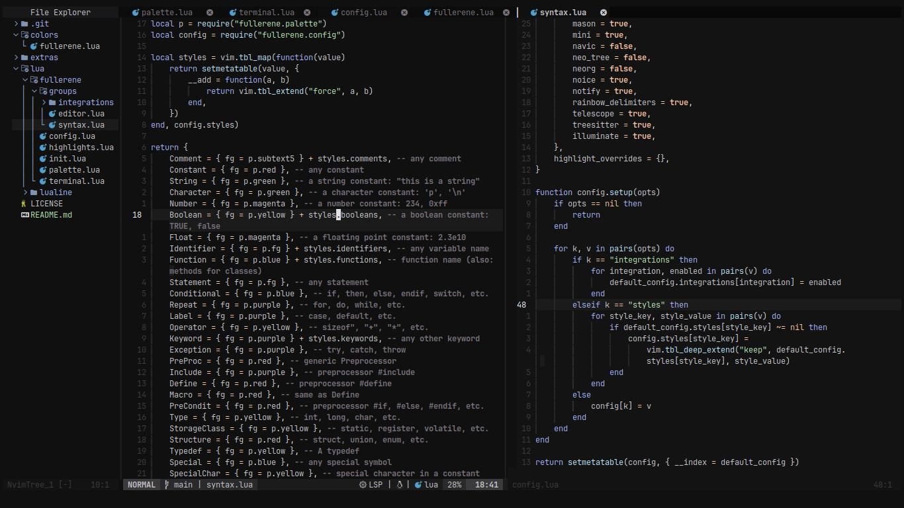

<h1 align="center">Fullerene.nvim</h1>

<div align="center">
  
</div>

</br>

<p align="center">
  A dark colorscheme for Neovim inspired by
  <a href="https://github.com/sam4llis/nvim-tundra">sam4llis/nvim-tundra</a>
  and <a href="https://github.com/dgox16/oldworld.nvim">dgox16/oldworld.nvim</a>
</p>

---

 

## Installation

Using [lazy.nvim](https://github.com/folke/lazy.nvim):

```lua
{
    "steguiosaur/fullerene.nvim",
    lazy = false,
    priority = 1000,
}
```

## Usage

Using lua:

```lua
vim.cmd.colorscheme("fullerene")
```

## Configuration

Default configuration will be used unless changed

```lua
local default_config = {
    terminal_colors = true, -- enable terminal colors
    styles = { -- You can pass the style using the format: style = true
        comments = {}, -- style for comments
        keywords = {}, -- style for keywords
        identifiers = {}, -- style for identifiers
        functions = {}, -- style for functions
        variables = {}, -- style for variables
        booleans = {}, -- style for booleans
    },
    integrations = { -- You can disable/enable integrations
        alpha = true,
        cmp = true,
        flash = true,
        gitsigns = true,
        hop = false,
        indent_blankline = true,
        lazy = true,
        lsp = true,
        markdown = true,
        mason = true,
        navic = false,
        neo_tree = false,
        neorg = false,
        noice = true,
        notify = true,
        rainbow_delimiters = true,
        telescope = true,
        treesitter = true,
    },
    highlight_overrides = {}
}
```

Configure the setting using the `setup` function with the desired options.

```lua
require("fullerene").setup({
    styles = {
        booleans = { italic = true, bold = true },
    },
    integrations = {
        hop = true,
        telescope = false,
    },
    highlight_overrides = {
        Comment = { bg = "#ff0000" }
    }
})
```
